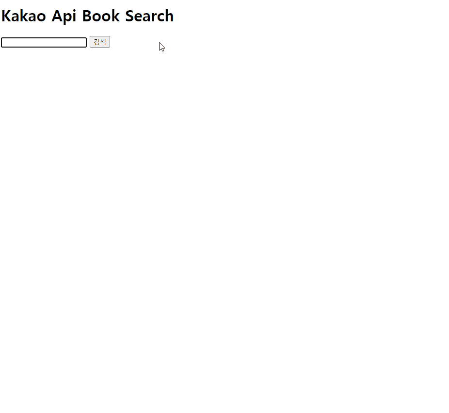

# kakao-book-search(api practice)

> 카카오톡 api를 통해 api 연습해보기

참고 강의 : https://www.youtube.com/watch?v=QPEUU89AOg8&t=115s

# Result

# 리뷰

강의에서 사용한 JQuery와 Vanilla JS(순수 자바스크립트) 두가지 버전으로 만들어봤다.

api를 사용하니 재밌는 것들을 많이 만들 수 있을 거 같다.

다음엔 미세먼지나 코로나 api를 이용해서 연습해봐야겠다.
